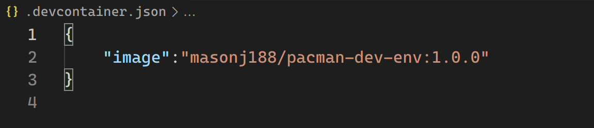
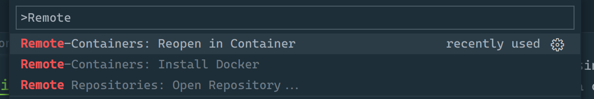
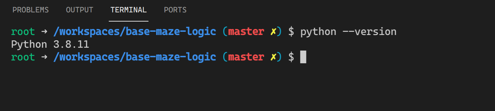
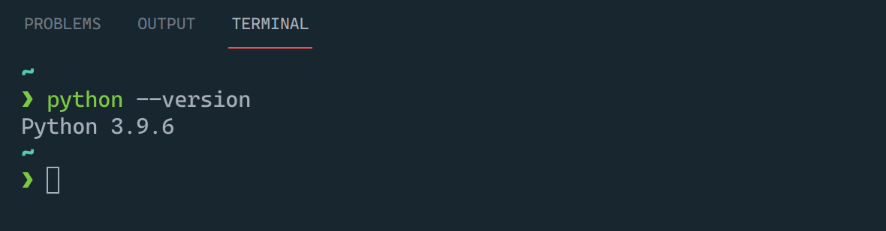
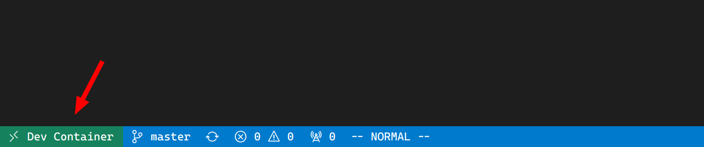
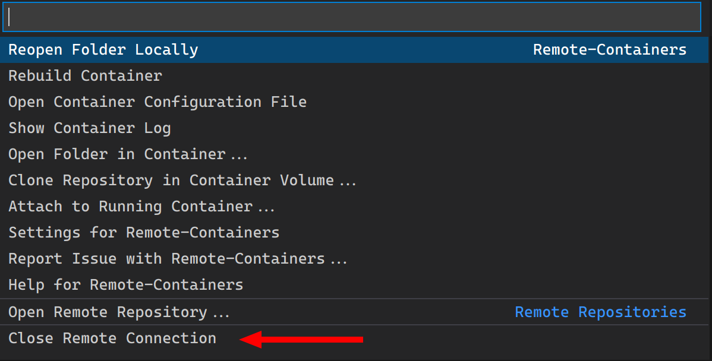
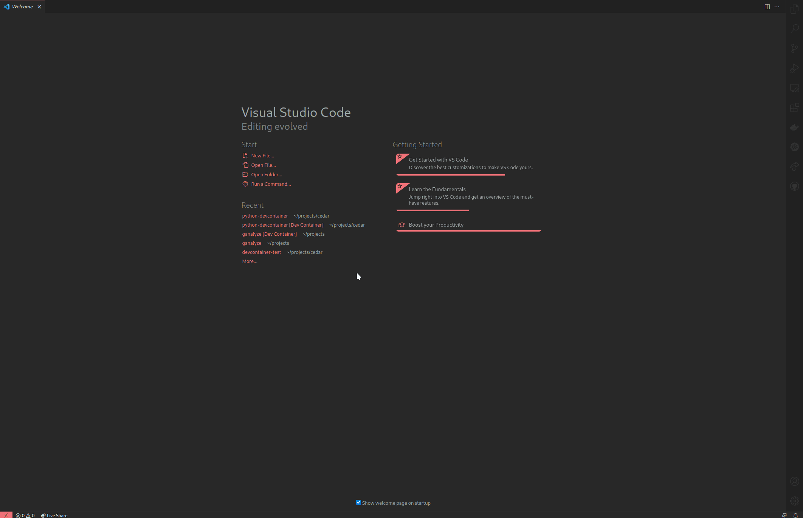

# Prerequisites

## Install Remote Development Extension

1. Open VS Code
2. Under the **Extensions** tab in your side-bar, search for **"Remote Development"**
3. Install the **Remote Development** extension from Microsoft. The description should start with "An extension pack that lets you..."


## Install Docker

1. Open VS Code
2. Open the Command Palette (ctrl+shift+P / cmd+shift+P)
3. Type "Remote-Containers Install Docker" and select that option
4. Follow the instructions for your OS & architecture*. If you're on Windows/Mac it will be **Docker Desktop**, if you're on Linux, it'll be **Docker Server**.

\*I _highly_ recommend you use the WSL2 backend if you're on Windows. Follow
the instructions under **System Requirements** to get WSL2 installed (and don't forget to install the kernel update package listed there).

# Dev Container Basics

## Container Recap
In general, a container is an isolated environment that shares a _Linux_ kernel with the host it's running on. 

### Container vs. VM
Containers are in contrast to a virtual machine in that a virtual machine _virtualizes_ the entire operating system, _including_ the kernel (be it a Windows or Linux kernel). It may or may not (but usually does) contain the _userspace_ portion of a Linux-based OS to provide services for whatever is running in the container.

Virtual Machine:


Container:


Images can be found [here](https://docs.microsoft.com/en-us/virtualization/windowscontainers/about/containers-vs-vm).


### What's the point?
Containers are useful for several reasons, but the primary one is that you can bundle all the dependencies and applications you need into a single unit that won't interfere or conflict with the host system. This is particularly useful for application _deployment_ but as we'll see, it has some great advantages for application _development_ as well.

Rather than having everyone try to tailor their host system to the exact specifications of a project (same Python version, same Poetry version, same Go version, etc), we can specify the exact needs within a container and then do our development in there.

## Containers and VS Code
Visual Studio Code provides some amazing integrations with containers that make it very simple to use the tools and applications installed within a container instead of the tools/applications installed on the host machine.

### Remote Development Extension
The [Remote Development Extension Pack](https://marketplace.visualstudio.com/items?itemName=ms-vscode-remote.vscode-remote-extensionpack) facilitates using a "remote" environment to develop code within. The remote environment can be a container - which is what we're using it for - but it could also be another machine accessible through SSH, or even a Linux distribution installed through WSL2 on Windows.

When using the extension to develop within a container, VS Code launches the container, _mounts_ the workspace folder containing your code inside the container, then opens a _shell_ inside the container. Keep in mind that your code is stored _outside_ the container, and then is made visible within the container. Any edits or changes you make inside the container to your workspace files will be visible outside the container. This means you can use Git as you normally would (through Docker Desktop, GitKraken, etc).

### .devcontainer File
VS Code looks for a specific file called `.devcontainer.json` in the root of your workspace. It can also be stored in a folder as `.devcontainer/devcontainer.json` in the workspace root if you prefer. This file is what tells VS Code what container image to use and any settings you'd like to apply to that container.



### Developing in a preconfigured project

 _If_ you have Docker running _and_ there is a `.devcontainer.json` file present, VS Code will give you a popup that says "re-open in container" anytime you open that project. If for whatever reason you don't get the pop-up but know a project is set up to use containers, you can open the Command Palette (ctrl+shift+P / cmd+shift+P) and start typing `Remote-Containers: Reopen in container` to bring up the option to open your workspace within a container.

 

Once VS Code reloads the integrated terminal at the bottom of your VS Code will be running _inside_ the container. Any tools or applications that are installed inside the container will be available to use.

Inside container:



Outside container (on host):



Once you're inside the container, you can develop as you normally would! After you've made your changes, you can use `Git` as you normally would through Docker Desktop, GitKraken, through a Powershell terminal or any other way you're used to. 

If you need additional tools inside the container that aren't already installed you can install them using `apt` as you would on any regular Ubuntu/Debian installation. (This assumes the base image of the container is based on Ubuntu or Debian). Just keep in mind that tools installed this way may not persist if the container is deleted, you might have to reinstall them at some point in the future. If there's a tool you think should be included by default, get with whoever is managing the dev container and ask them to include it in the `Dockerfile` or in the `.devcontainer.json`.

To close your connection to the container, click on the `Dev Container` portion of the status bar in the lower left:



Select `Close Remote Connection`:



Once your workspace reloads, you'll be back in your normal VS Code window.

# Creating Your Own Dev Container

## Prebuilt Images

For simple use cases, chances are that there is already an image that suits your needs - particularly if your project only uses one programming language.

To search for and use a pre-existing image, do the following:

1. Open your project folder in VS Code
2. Open the command palette (ctrl+shift+P / cmd+shift+P)
3. Start typing `Remote-Containers: Reopen in Container` and select that option
4. Browse the list for an image appropriate for your environment and select it

Selecting one of the pre-made images will create a `.devcontainer` folder in your workspace root that contains `.devcontainer.json` and a `Dockerfile`.

## Modifying Prebuilt Images
Sometimes the prebuilt image is missing a tool or two that you need; there are two main ways to add a tool/package to the image/container.

### Modifying devcontainer.json
The reference for `devcontainer.json` can be found [here](https://code.visualstudio.com/docs/remote/devcontainerjson-reference). It includes all of the different settings and options available for you to specify.

The settings that will help us install missing tools are the `postCreateCommand` and `postStartCommand` directives. These will allow us to modify the base container after it's created or started, respectively.

#### Example
As an example, suppose our project uses `Python`, but we use `Poetry` to manage our dependencies. Since `Poetry` is not included in the default Python image, we need to install it ourselves. You might do something like this:

1. Open your existing Python project in VS Code
2. Open the command palette and reopen in a container (see step 3 above)
3. Select the `Python 3` image and then which version of `Python 3` you want
4. Modify the newly created `.devcontainer/devcontainer.json` file
    - Add the `"postCreateCommand"` directive and set it to `"curl -sSL https://raw.githubusercontent.com/python-poetry/poetry/master/get-poetry.py | python -"` (install instructions from the [Poetry documentation](https://python-poetry.org/docs/))
    - Add the `"remoteEnv"` directive and set it to `{"PATH": "${containerEnv:PATH}:/home/vscode/.poetry/bin",}` to add the Poetry `bin/` directory to the `$PATH` environment variable.
5. Open the command palette and execute the `Remote-Containers: Rebuild Container` command in order to rebuild the container with your new additions.

If for some reason you need your command to execute _after_ the container has already started, substitute `postCreateCommand` with `postStartCommand`. If you need to execute multiple different commands, chain them together with `&&`.

Lines added:

```json
"postCreateCommand": "curl -sSL https://raw.githubusercontent.com/python-poetry/poetry/master/get-poetry.py | python -",
"remoteEnv": {
	"PATH": "${containerEnv:PATH}:/home/vscode/.poetry/bin",
},
```

Full process:




### Modifying Dockerfile

A potential disadvantage of modifying the base image by adding a `postCreateCommand/postStartCommand` is that if your container is removed, any commands added this way will have to be run again in the new container.

Instead of adding them after a container has been created, we can add our tools to the `Dockerfile` and modify the image itself. This way, every container based off of that image will contain the changes. Luckily, when we select a prebuilt image we also get the `Dockerfile` that defines that image - we can modify the `Dockerfile` and rebuild the _image_ instead of a _container_. Then every container started after we've rebuilt the image will have our new tools installed. The reference for a `Dockerfile` can be found [here](https://docs.docker.com/engine/reference/builder/).

#### Example

We can achieve the same effect as above, but using the `Dockerfile` instead of the `.devcontainer/devcontainer.json` file as follows:

1. Open your existing Python project in VS Code
2. Open the command palette and reopen in a container (see step 3 under [Prebuilt Images](#prebuilt-images))
3. Select the `Python 3` image and then which version of `Python 3` you want
4. Modify the `.devcontainer/Dockerfile` file
    - Add a `RUN` directive like so: `su vscode -c "curl -sSL https://raw.githubusercontent.com/python-poetry/poetry/master/get-poetry.py | python -"`
5. Open the command palette and execute the `Remote-Containers: Rebuild Container` command in order to rebuild the image (and create a new container) with your new additions.

The default images from VS Code have a `vscode` user that is used instead of the `root` user. Poetry configures itself to work for the user that executes the install script, so we can use `su vscode -c COMMAND` to execute the install script as the `vscode` user instead of the `root` user. In this case, the `$PATH` environment variable is configured correctly by the Poetry install script, so no changes to the `$PATH` env variable are necessary.

Added line:
```
RUN su vscode -c "curl -sSL https://raw.githubusercontent.com/python-poetry/poetry/master/get-poetry.py | python -"
```

## Starting From Scratch (kind of)

If your project uses multiple programming languages it might be easiest to start from a regular `Ubuntu` base image and add your languages and tools to the base image. Luckily, VS Code has a base Ubuntu image that we can start from:

1. Open your existing project in VS Code
2. Open the command palette and reopen in a container (see step 3 under [Prebuilt Images](#prebuilt-images))
3. Select the `Ubuntu` image and select the version you'd like (the default is usually fine)
4. Modify the newly created `.devcontainer/Dockerfile` file
    - Read the existing comments in the Dockerfile giving instructions for adding packages using `apt`
    - If the languages/tools you need aren't in the Ubuntu repos, you may have to install them through other means (like Poetry above)
5. Open the command palette and execute the `Remote-Containers: Rebuild Container` command in order to rebuild the image (and create a new container) with your new additions.

### Example

An example `Dockerfile` that installs `Python3.9` from the official Ubuntu repositories and installs `Go` manually might look like this:

```Dockerfile
# See here for image contents: https://github.com/microsoft/vscode-dev-containers/tree/v0.187.0/containers/ubuntu/.devcontainer/base.Dockerfile

# [Choice] Ubuntu version: bionic, focal
ARG VARIANT="focal"
FROM mcr.microsoft.com/vscode/devcontainers/base:0-${VARIANT}

# Install python3.9 and wget from Ubuntu repos
RUN apt-get update && export DEBIAN_FRONTEND=noninteractive \
    && apt-get -y install --no-install-recommends python3.9 wget

# Symlink python3.9 to python (be careful with this, not always desirable)
RUN ln -s /usr/bin/python3.9 /usr/bin/python

# Install Go manually
RUN wget https://golang.org/dl/go1.16.6.linux-amd64.tar.gz && tar xvf go1.16.6.linux-amd64.tar.gz -C /usr/local/
ENV PATH=/usr/local/go/bin:$PATH
```

From here, you might add debuggers, network tools, or anything else you use for development on your project.


## Using Dockerhub

Whether you start from a blank Dockerfile or you modify one of the pre-made Dockerfiles existing in Dockerhub, you can upload your prepared image to [Dockerhub](https://hub.docker.com/).

While it is completely fine to build an image locally using a Dockerfile, if the build process is particularly long you may not want everyone using your image to have to build it when they want to use it. To eliminate build times, you can build an image once, and then tag and upload that image to Dockerhub. Once the image is in Dockerhub, your users can access the image by pulling the image from the network instead of building it locally using the Dockerfile.

### Using Dockerhub Images in devcontainer.json
To use an image that's available on Dockerhub, add the `image` directive to your `devcontainer.json` file with the value being the Dockerhub path of the image, like so:

```json
"image":"masonj188/pacman-dev-env:1.0.0"
```

Using the `image` directive instead of the `build` directive tells VS Code to pull the image from Dockerhub instead of trying to build an image from a local Dockerfile.

### Pushing Images to Dockerhub

To push an image to Dockerhub follow these steps:

1. Head to the [Dockerhub website](https://hub.docker.com/) and create an account if you don't already have one.
    - Free accounts are allowed to host as many public images as they want, but you're limited to _one_ private repository without a paid account.
    - Make sure you never add any sensitive data to an image that's hosted publicly on Dockerhub.

2. Login to Dockerhub using the Docker cli command `docker login`.

3. Build and tag your image using `docker build . -t <username>/<repository>:<tag>` from the same directory as your Dockerfile.
    - To learn more about tagging images read the documentation [here](https://docs.docker.com/engine/reference/commandline/build/#tag-an-image--t).

4. Update your `devcontainer.json` file to reference your newly pushed image.